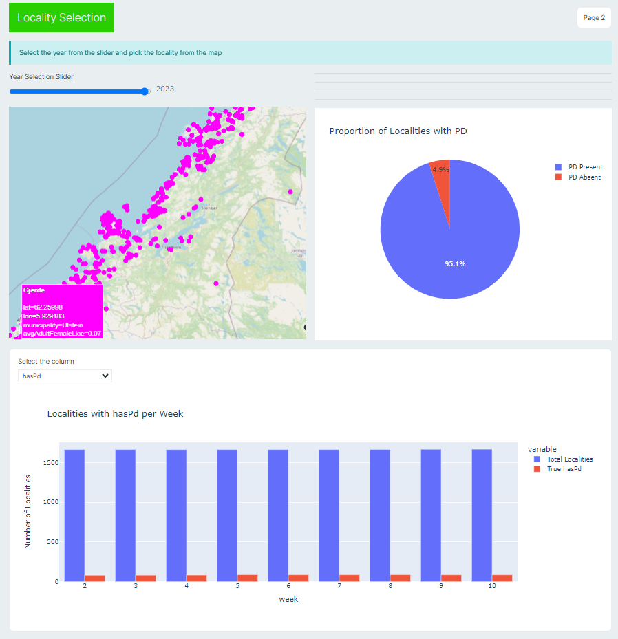
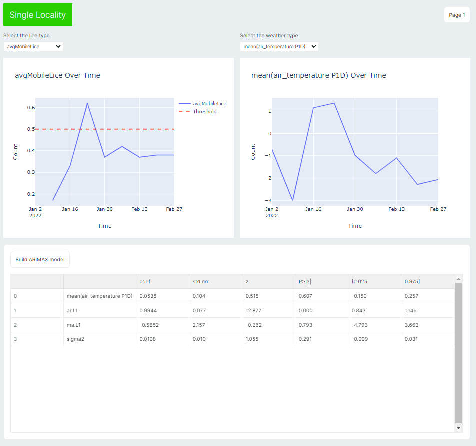

# AquaHealth Analytics Dashboard

## Overview

The **AquaHealth Analytics Dashboard** is an interactive application developed using Python and Streamsync for monitoring and analyzing aquaculture health and environmental data over a span of 20 years. The dashboard integrates advanced data processing techniques, Plotly visualizations, and ARIMA modeling to provide predictive insights essential for sustainable fish farming practices.

## Features

- **Interactive Visualizations**: Utilize Plotly to create dynamic and interactive visualizations, including maps, bar charts, and pie charts, providing comprehensive insights into aquaculture data across multiple localities.
  
- **Predictive Modeling**: Leverage ARIMA models to forecast key metrics such as lice count and environmental factors for selected localities, aiding in proactive decision-making.
  
- **Data Processing**: Efficiently handle and manipulate large datasets using Pandas, ensuring smooth and responsive user experiences even with extensive historical data.

- **User-Friendly Interface**: The dashboard offers an intuitive interface that allows users to select years, localities, and visualization parameters, with instant feedback and updates to the visualizations.

## Application Flow

### 1. Initialization and Authentication

- The application starts by initializing with predefined states, setting up titles, and default values.
- Upon first run, the app displays initial plots to familiarize users with the interface.
- Authentication is handled by the `get_token` function, which accesses the required APIs.

### 2. Data Fetching and Preparation

- Data for the selected year is fetched using `year_data` and `get_year_data`, retrieving aquaculture data for all localities and then focusing on a single locality.
- The fetched data is organized into Pandas DataFrames for efficient processing and manipulation.

### 3. Visualization Setup

- Processed data is visualized using Plotly, with various charts and maps being generated to represent data across all localities and for individual localities.
- Weather data specific to a locality is visualized to correlate environmental conditions with aquaculture health.

### 4. User Interaction Handling

- Users can interact with the dashboard by selecting years, localities, or changing visualization parameters.
- Handlers like `handle_year` and `handle_click` respond to these inputs, updating the application state and triggering data refreshes or visualization updates.

### 5. Detailed Analysis and Forecasting

- For selected localities, the dashboard fetches detailed data on lice counts and weather conditions.
- An ARIMA model is built and applied to forecast trends, providing users with predictive insights.

### 6. State Management and UI Updates

- The application’s state is continuously updated based on user interactions and data processing results.
- Changes in state are reflected in the UI, such as updating plots when new data is selected or displaying the results of ARIMA analysis.

